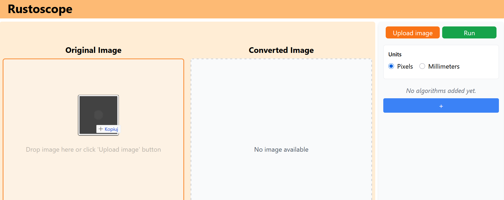
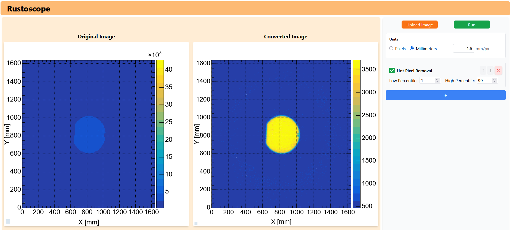

<div align="center">
  
</div>

# Rustoscope

WebAssembly image analysis, using Rust.

## 🌐 Live Demo

You can view the latest deployed version here:
🔗 [https://datamedsci.github.io/rustoscope/](https://datamedsci.github.io/rustoscope/)

## 🎯 Aim of the Project

**Rustoscope** is a high-performance, browser-based tool designed for **scientific image analysis**. By leveraging **Rust** and **WebAssembly (Wasm)**, it enables users to run computationally intensive image processing algorithms directly on the client side.

## 📸 Usage

Rustoscope provides a streamlined workflow for image analysis:

1.  **Upload**: Drag and drop your image (PNG, JPG, TIFF) or use the file picker.

    

2.  **Visualize**: The image is rendered using **JSROOT**, allowing you to inspect pixel intensities with a configurable color map.

    - _Feature_: Toggle axes (px/mm) and adjust the scale.

3.  **Process**: Select algorithms from the sidebar to apply to your image.

    - **Hot Pixel Removal**: Remove noise using percentile clipping.
    - **Blur**: Apply Gaussian or Median blur to smooth data.
    - **Linear Transform**: Adjust intensity using $a \cdot x + b$.

    

4.  **Analyze**: View the "Original" and "Processed" images side-by-side to verify results instantly.

    

## 📦 Getting Started

### ✅ Prerequisites

Make sure the following tools are installed:

- [`pnpm`](https://pnpm.io/)
- [`wasm-pack`](https://rustwasm.github.io/wasm-pack/)

> 💡 Additionally, ensure Rust and `cargo` are installed. If not, install them with:
> `curl https://sh.rustup.rs -sSf | sh`
>
> **Note:** We recommend installation via [rustup](https://rustup.rs/) instead of using your system package manager, as we encountered issues with the `wasm-pack` package in some distributions.
> We tested the project using `1.86.0` version of Rust, thus we recommend using this version or later.

## 📖 Project Structure

The project is structured as follows:

```
rustoscope/
├── api/                # Rust backend for WebAssembly (Algorithms & Image Handling)
├── client/             # Frontend application (React, Vite, JSROOT)
├── .github/            # GitHub Actions workflows
├── .gitignore          # Git ignore file
└── README.md           # This file
```

### 🛠️ Installation

1. Clone the repository:

   ```bash
   git clone https://github.com/your-username/rustoscope.git
   ```

2. Install frontend dependencies (inside the `client/` directory):

   ```bash
    pnpm install
   ```

### 🚀 Running the Project

1. Build WebAssembly from Rust source code (inside the `api/` directory):

```bash
  wasm-pack build --target web --out-dir ../client/src/wasm
```

2. Start the development server (inside the `client/` directory):

```bash
  pnpm run dev
```

### 🚢 Deployment (GitHub Pages)

To deploy the application (inside the `client/` directory):

```bash
pnpm run deploy
```

## ✨ Current Functionalities

- **Input Support**:
  - Drag-and-drop or file picker upload.
  - Supports PNG, JPG/JPEG, and TIFF formats.
- **Scientific Visualization**:
  - **JSROOT Integration**: Interactive rendering of **intensity maps** with color maps, grids, and auto z-range.
  - **Stable Aspect Ratio**: Side-by-side comparison of Original vs. Converted images.
  - **Measurement**: Axes display in pixels or millimeters with configurable scale.
- **Wasm-Powered Algorithms**:
  - **Hot Pixel Removal**: Percentile clipping to remove high-intensity noise (supports 8/16-bit).
  - **Median Blur**: Configurable kernel radius for noise reduction (supports 8/16-bit).
  - **Gaussian Blur**: Smoothing with adjustable sigma (supports 8/16-bit).
  - **Linear Transform**: Pixel intensity adjustment ($a \cdot x + b$) (supports 8/16-bit).
- **Data Handling**:
  - Direct processing of 8-bit and 16-bit grayscale data.

## 📜 Development History

The project has evolved through two distinct phases under the continuous supervision of **PhD. Leszek Grzanka**, combining academic research with professional scientific application:

1.  **Academic Origins (Large Scale Computing Course)**:
    The project was originally created by **Jakub Stępień**, **Kacper Cienkosz**, and **Adam Mytnik** as part of the _Large Scale Computing_ course at **AGH University of Science and Technology** in Kraków. This phase established the core architecture and implemented the first set of WASM-powered algorithms:

    - **Core Architecture**: A robust Rust backend compiling to WebAssembly, integrated with a React frontend for side-by-side image comparison.
    - **Implemented Algorithms**:
      - **Basic Transformations**: Grayscale conversion and color inversion.
      - **Noise Reduction**: Gaussian blur (sigma) and Median blur (kernel radius).
      - **Pixel Manipulation**: Percentile clipping for hot pixel removal.

    Original repository: [jkbstepien/rustoscope](https://github.com/jkbstepien/rustoscope)

<br>

2.  **Scientific Expansion (IFJ PAN Traineeship)**:
    The project was significantly expanded during the traineeship of **Marek Swakoń** at the **Institute of Nuclear Physics Polish Academy of Sciences (IFJ PAN)**
    This phase shifted the focus towards scientific data analysis, introducing:
    - **16-bit Support**: Handling of 16-bit grayscale data (intensity maps).
    - **Advanced Visualization**: Integration of **JSROOT** for interactive, scientific-grade image previews (color maps, auto z-range, grid).
    - **Support for Drag-and-Drop Upload**: Enhanced user experience for image input.
    - **Scale Measurement**: Displaying axes in pixels or millimeters with configurable scale.
    - **Linear Transform Algorithm**: Pixel intensity adjustment using the formula $a \cdot x + b$.

## 👥 Authors & Contributors

**Core Contributors**:

1.  **Jakub Stępień** ([@jkbstepien](https://github.com/jkbstepien))
2.  **Kacper Cienkosz** ([@kacienk](https://github.com/kacienk))
3.  **Adam Mytnik** ([@AdamMytnik](https://github.com/AdamMytnik))
4.  **Marek Swakoń** ([@Marek55S](https://github.com/Marek55S))

**Supervision**:

- **PhD. Leszek Grzanka** ([@grzanka](https://github.com/grzanka))
